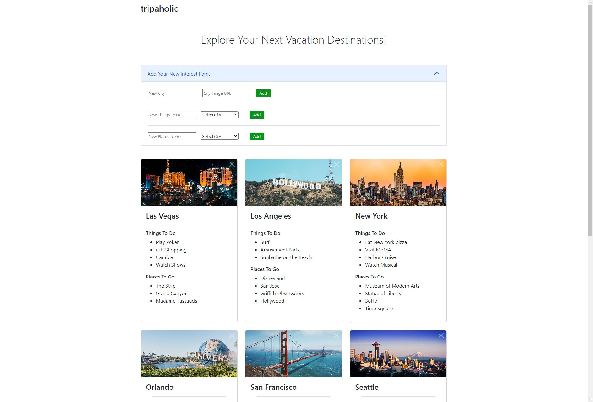

<h1 align="center">tripaholic</h1>
<h3 align="center">Back End Repo</h3>

<br/>

<p align="center">
A single-page app to list places you want to go and what you want to do or see there
</p>

<br/>

<p align="center">
  
</p>

<br/>

## Frontend Git Repository
https://github.com/baikjs87/phase-3-project-frontend

## Backend Git Repository
https://github.com/baikjs87/tripaholic_backend

### Start The Backend Server
```bash
 $ bundle exec rake server
```